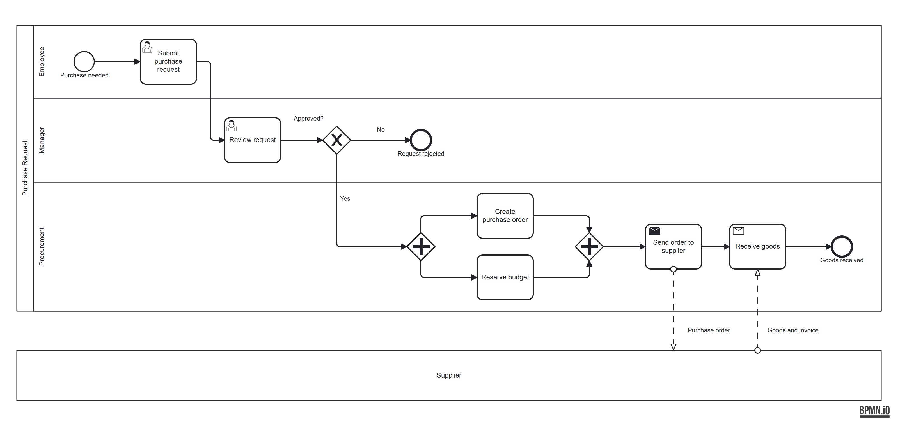

# BPMN for Claude Code

Three [Claude Code](https://code.claude.com) skills for process mapping. Describe a process in plain language and get a standard BPMN 2.0 diagram. Check it against the notation rules. Hand it to stakeholders in FigJam.



| Skill | What it does |
|---|---|
| [`bpmn`](skills/bpmn/SKILL.md) | Turns a description into a `.bpmn` file that opens in [bpmn.io](https://demo.bpmn.io) and Camunda Modeler, with an optional HTML viewer card. Also reads an existing `.bpmn` file back into structured prose: roles, steps, decisions, handoffs |
| [`bpmn-coach`](skills/bpmn-coach/SKILL.md) | Validates a diagram and explains every problem in plain business language, ranked Must fix / Should fix / Consider. The checks run in a [standard-library Python script](skills/bpmn-coach/scripts/validate.py), so the same file always gets the same findings |
| [`bpmn-to-figjam`](skills/bpmn-to-figjam/SKILL.md) | Draws a `.bpmn` file in a FigJam board through the Figma MCP server, styled like bpmn.io, inside its own section so existing board content is never touched |

The skills work together. `bpmn` checks its own output with `bpmn-coach` before saving. `bpmn-coach` can ask `bpmn` to regenerate a corrected diagram, and the result is checked again.

## Quick start

You need Claude Code and Python 3.9 or newer. `bpmn-to-figjam` also needs a connected [Figma MCP server](https://help.figma.com/hc/en-us/articles/32132100833559).

```bash
git clone https://github.com/gersoncorreias/claude-bpmn.git
cd claude-bpmn
./install.sh            # installs the three skills into ~/.claude/skills/
```

Then, in Claude Code:

```
/bpmn Create a BPMN for our employee onboarding: HR prepares the contract, IT sets up the laptop and
accounts in parallel, then the manager schedules the first week.

/bpmn-coach validate ./employee-onboarding.bpmn

/bpmn-to-figjam ./employee-onboarding.bpmn https://www.figma.com/board/<fileKey>/<name>
```

On Windows without bash, copy the three folders in `skills/` into `%USERPROFILE%\.claude\skills\`.

**[examples/README.md](examples/README.md)** walks through each skill with real output, including a flawed diagram and the coach's report on it.

## The validator on its own

The coach's checks are a single script with no dependencies. You can use it outside Claude, in CI or a pre-commit hook:

```text
$ python skills/bpmn-coach/scripts/validate.py examples/broken-expense-claim.bpmn --format text
ERROR    STR-006  Employee / Revise expense claim: This element has no outgoing flow, so the process stops here without reaching an end event.
WARNING  GW-003   Manager / Decision: 2 of 2 outgoing paths have no condition label (Flow_4, Flow_5).
INFO     GW-006   Manager / Decision: Name decisions as a question, e.g. 'Approved?'.
1 error(s), 1 warning(s), 1 info
```

- **Output.** JSON by default (`--format text` for people). Each finding carries the lane, pool and neighbouring steps, so it can be described without IDs.
- **Exit codes.** `0` means no errors, `1` means at least one error, and `2` means the file is not valid XML or not BPMN 2.0.
- **Rules.** 32 checks run in the script, plus one that needs judgement (task names without a verb), which the skill applies. Run `--rules` for the list. [The rules reference](skills/bpmn-coach/references/bpmn-validation-rules.md) has the condition and fix for each.

| Family | Catches |
|---|---|
| Structure (STR) | Missing start or end, broken references, steps nothing leads to, paths that stop before the end, lane assignment |
| Gateways (GW) | Diamonds that merge and split at once, decisions that decide nothing, unlabelled paths, parallel splits that never join |
| Events (EVT) | Flows into a start or out of an end, boundary events on the wrong thing, catch events with no trigger |
| Flows (SF) | Sequence flows across pools, loops with no way out, message flows inside one pool |
| Pools and lanes (LP) | Pools pointing at missing processes, single-lane pools |
| Naming (NM) | Unnamed steps and events, task names without a verb |
| Layout (DI) | Elements or flows missing from the drawing, stray shapes, overlaps, shapes outside their pool |

Valid patterns that simple checkers get wrong are handled correctly: link events, event sub-processes, compensation handlers, boundary events, nested lanes and expanded sub-processes.

## What it will and won't do

- **Descriptive diagrams, not executable ones.** Generated processes are `isExecutable="false"`, for documentation, analysis and stakeholder review. Nothing here deploys to a BPMN engine.
- **Files stay local.** `bpmn` and `bpmn-coach` read and write files on your machine. Only `bpmn-to-figjam` sends anything out, and only to the Figma board you name.
- **FigJam renders are approximate.** FigJam has no BPMN shapes, so events, gateways and markers are drawn with FigJam's basic shapes and connectors. Expanded sub-processes are supported one level deep.
- **Layout is generated, not designed.** `bpmn` places elements on a grid. Complex diagrams may need a tidy-up in bpmn.io or Camunda Modeler before you present them.

## Development

```bash
python -m unittest discover -s tests -v              # validator, rules doc, repo hygiene (standard library only)
cd tests/bpmnio && npm ci && npm run check           # every shipped .bpmn parses cleanly in bpmn-moddle
```

`tests/fixtures/` has one deliberately broken diagram per rule family. `expected.json` lists the exact findings each must produce, and a test fails if any rule has no fixture. Each skill also has `evals/evals.json` with prompts and assertions for checking the skill's behaviour in Claude Code. See [CONTRIBUTING.md](CONTRIBUTING.md).

## License

[MIT](LICENSE)
