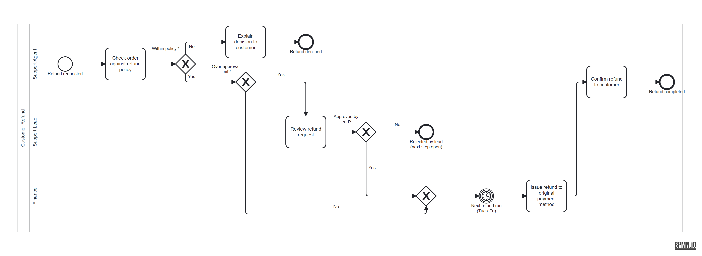
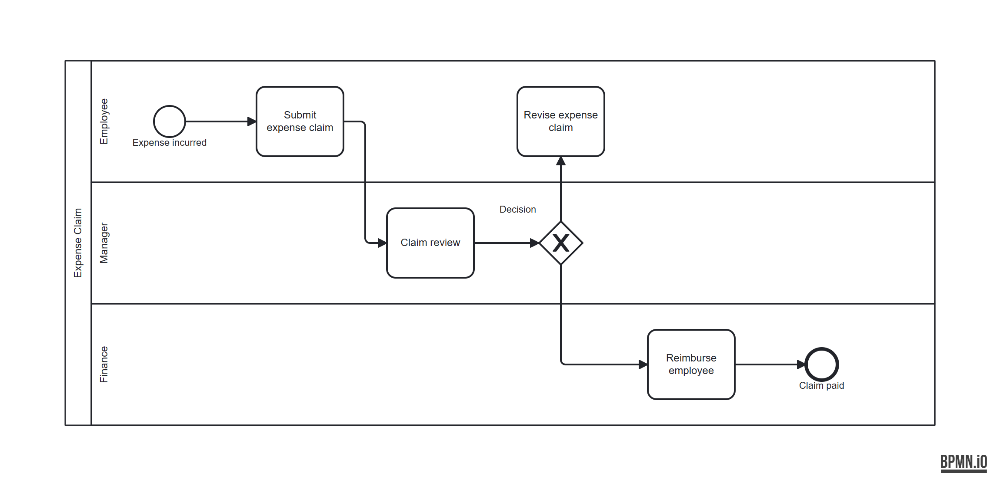
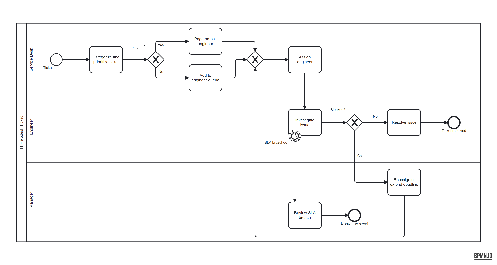

# Examples

## 1. Map a process from a meeting transcript

[`transcript-to-bpmn/refund-mapping-session.vtt`](transcript-to-bpmn/refund-mapping-session.vtt) is a short fictional mapping session. A support agent, a support lead and a finance analyst walk a facilitator through customer refunds.

**Ask Claude:**

```
/bpmn Map the refund process from examples/transcript-to-bpmn/refund-mapping-session.vtt
```

**You get two files:**

- [`customer-refund.bpmn`](transcript-to-bpmn/customer-refund.bpmn), with 0 validator findings:

  

- [`customer-refund-mapping-notes.md`](transcript-to-bpmn/customer-refund-mapping-notes.md), the part a process owner can check:
  - a steps table with a timestamped quote for every element
  - one inference, marked as such (the merge before the refund run)
  - the $200 vs $250 approval-limit contradiction, with both timestamps
  - four open questions, starting with the one nobody could answer: what happens when the lead rejects a refund?

**What the skill does not do:** guess. The lead-rejection path ends in "Rejected by lead (next step open)" instead of an invented step. Month-end reconciliation was mentioned but is not part of the flow, so it is listed under "Not modelled".

## 2. Validate a flawed diagram

[`broken-expense-claim.bpmn`](broken-expense-claim.bpmn) is a small expense-claim process with three deliberate mistakes. Here it is in bpmn.io:



**Ask Claude:**

```
/bpmn-coach validate examples/broken-expense-claim.bpmn
```

**Step 1: the validator.** The skill first runs the script, which gives the same answer every time:

```text
$ python skills/bpmn-coach/scripts/validate.py examples/broken-expense-claim.bpmn --format text
ERROR    STR-006  Employee / Revise expense claim: This element has no outgoing flow, so the process stops here without reaching an end event.
WARNING  GW-003   Manager / Decision: 2 of 2 outgoing paths have no condition label (Flow_4, Flow_5).
INFO     GW-006   Manager / Decision: Name decisions as a question, e.g. 'Approved?'.
1 error(s), 1 warning(s), 1 info
```

The full JSON, with lane, pool and neighbouring steps for each finding, is in [`broken-expense-claim.validator.json`](broken-expense-claim.validator.json).

**Step 2: the report.** Claude adds the one rule that needs judgement (task names without a verb). It then writes the findings for the person who owns the process, using no XML terms and no element IDs. A typical report:

> ## BPMN Coach Report: Expense Claim
>
> ### Summary
> 1 issue to fix · 3 improvements to consider
>
> ### Must Fix ❌
>
> **A rejected claim goes nowhere**
> When the manager sends a claim back, the flow reaches **Revise expense claim** in the **Employee** lane and stops. Nothing says what happens next, so a returned claim is never resubmitted and never closed.
> → **How to fix:** Draw an arrow from **Revise expense claim** back to **Claim review**, so the revised claim is reviewed again. Or end that path with an end event such as "Claim withdrawn". (STR-006)
>
> ### Should Fix ⚠
>
> **The two paths out of the decision have no labels**
> After **Claim review**, the decision splits towards **Revise expense claim** and **Reimburse employee**, but neither arrow says when it is taken.
> → **How to fix:** Label the arrows, for example "Rejected" and "Approved". (GW-003)
>
> **"Claim review" does not say what is done**
> Step names read best as an action. "Claim review" is a noun, so a reader cannot tell who does what.
> → **How to fix:** Rename it to "Review claim". (NM-002)
>
> ### Consider Improving ℹ
>
> **Phrase the decision as a question**
> The decision diamond is named "Decision", which does not say what is being decided.
> → **Suggestion:** Rename it to "Claim approved?". (GW-006)
>
> ### Verdict
> ❌ Issues found — resolve the "Must Fix" items before using this diagram
>
> **Want me to fix this?** I can invoke `/bpmn` to generate a corrected version of the diagram with the issues above resolved.

The exact wording varies from run to run. The findings do not, because they come from the script.

## 3. Generate a diagram from a description

**Ask Claude:**

```
/bpmn Create a BPMN for purchase approvals. An employee submits a request, their manager approves or
rejects it, then procurement creates the purchase order and reserves budget in parallel, sends the
order to the supplier and receives the goods.
```

The bundled template [`purchase-approval.bpmn`](../skills/bpmn/templates/purchase-approval.bpmn) is the kind of file this produces:


Before confirming, the skill runs the validator on its own output and fixes anything it finds.

## 4. Read a diagram back

```
/bpmn Describe skills/bpmn/templates/it-helpdesk-ticket.bpmn
```

This returns structured prose: roles, steps by role, decisions, handoffs between lanes, and notes such as the non-interrupting SLA timer. Other skills, or a person writing documentation, can use it directly.



## 5. Render it in FigJam

```
/bpmn-to-figjam skills/bpmn/templates/purchase-approval.bpmn https://www.figma.com/board/<fileKey>/<name>
```

This needs a connected Figma MCP server. The diagram is drawn inside a new section, `BPMN: Purchase Request`, to the right of whatever is already on the board. Nothing that is already there is changed.
